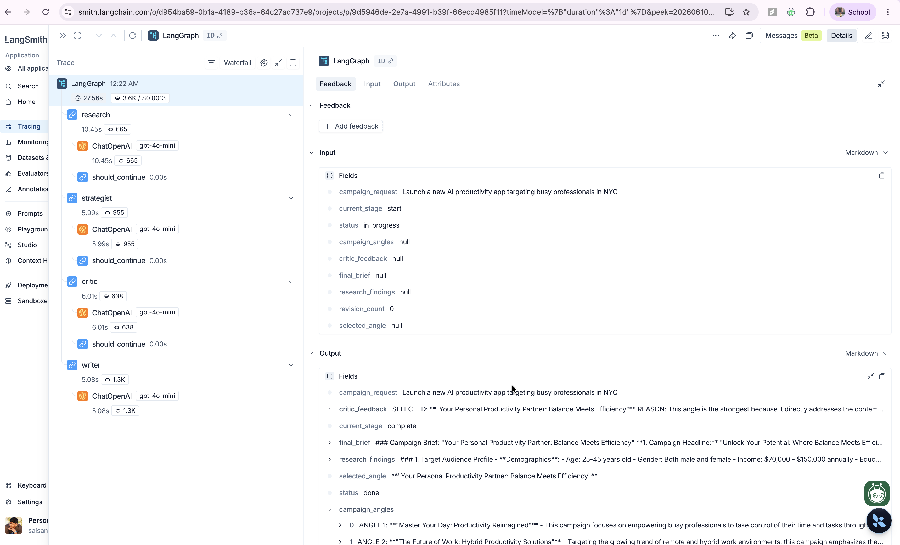

# Campaign Intelligence System

An autonomous multi-agent marketing system built with LangGraph demonstrating 
blackboard coordination, no central orchestrator, and full LangSmith tracing.

## Architecture

Four agents coordinate through a shared state object (the blackboard). 
No agent communicates with another directly.

- Research Agent: Analyzes market, audience, and competitor landscape
- Strategist Agent: Generates three distinct campaign angles from research
- Critic Agent: Scores angles and selects the strongest one
- Writer Agent: Produces the final campaign brief

## Key Design Decisions

- Blackboard pattern: all coordination happens through shared state
- No supervisor agent: routing is driven by state values via conditional edges
- Persistent execution: agents run in a continuous loop until status is done
- Full observability: every node execution traced in LangSmith

## How to Run

1. Clone the repo
2. Create a virtual environment and activate it
3. Run pip install langgraph langchain-openai langsmith python-dotenv
4. Add your API keys to a .env file
5. Run python main.py

## Built for

Demonstrating production-ready multi-agent architecture patterns 

## LangSmith Trace

